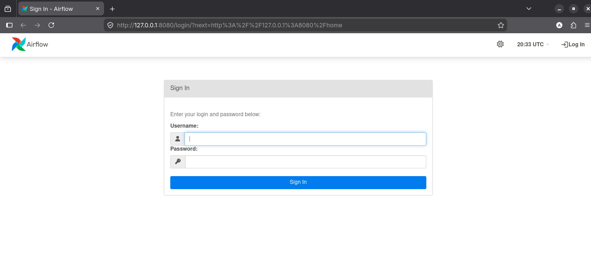
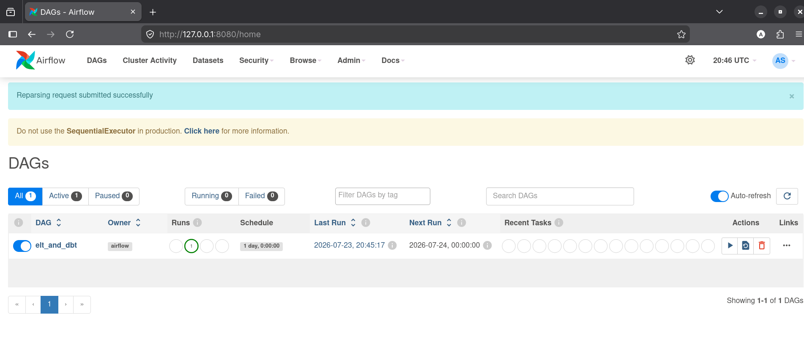

# Dockerized ELT Pipeline with PostgreSQL, dbt, Cron, and Airflow

This repository documents a layered data engineering project that starts with a simple Docker-based ELT pipeline and then evolves across branches into dbt transformations, cron scheduling, and Airflow orchestration.

The project demonstrates how data can be extracted from a source PostgreSQL database, loaded into a destination PostgreSQL database, transformed with dbt, and eventually orchestrated through Apache Airflow.

## Project Layers

I built this project in layers using separate Git branches:

| Branch | Purpose |
| --- | --- |
| `main` | Base ELT pipeline using Docker, Python, and PostgreSQL. |
| `dbt` | Adds dbt models for transforming loaded data in the destination database. |
| `cron` | Adds scheduled execution with cron. |
| `airflow` | Adds Apache Airflow for DAG-based orchestration and monitoring. |

Each branch builds on the previous layer, so the project shows the progression from a simple containerized ELT job to an orchestrated workflow.

## Tools Used

- **Docker**: Containerizes the source database, destination database, and ELT runtime.
- **Docker Compose**: Starts and connects all project services on a shared network.
- **PostgreSQL**: Used for both the source and destination databases.
- **Python**: Runs the custom ELT script.
- **pg_dump and psql**: Export data from the source database and load it into the destination database.
- **dbt**: Defines SQL-based transformation models in later branches.
- **cron**: Adds time-based scheduling in the cron layer.
- **Apache Airflow**: Orchestrates the ELT and dbt workflow in the Airflow layer.

## Repository Structure

```text
.
├── docker-compose.yaml
├── custom_elt/
│   ├── Dockerfile
│   └── elt_script.py
├── source_db_init/
│   └── init.sql
├── custom_postgres/
│   └── ...
└── docs/
    └── images/
        ├── airflow-login.png
        └── airflow-dags.png
```

## Core Services

The base `docker-compose.yaml` starts three main services:

| Service | Description |
| --- | --- |
| `source_postgres` | PostgreSQL source database initialized with sample data. |
| `destination_postgres` | PostgreSQL destination database where extracted data is loaded. |
| `elt_script` | Python container that runs the ELT script. |

The source database is exposed on port `5433`, and the destination database is exposed on port `5434`.

## How the ELT Pipeline Works

1. Docker Compose starts the source and destination PostgreSQL containers.
2. `source_db_init/init.sql` initializes the source database with sample tables and rows.
3. The Python ELT container waits until the source database is ready.
4. The script uses `pg_dump` to export the source database into a SQL dump file.
5. The script uses `psql` to load that dump into the destination database.
6. In the dbt layer, dbt models transform the loaded data.
7. In the Airflow layer, the workflow is managed as a DAG.

## Airflow Layer

The Airflow branch adds orchestration for the ELT and dbt workflow. The DAG is named `elt_and_dbt` and represents the pipeline as tasks instead of running everything manually.

Airflow login page:



Airflow DAGs page showing the `elt_and_dbt` DAG:



## Getting Started

Make sure Docker and Docker Compose are installed.

Clone the repository and start the stack:

```bash
docker compose up --build
```

After the containers start, the base ELT process runs through Docker Compose.

Database access:

| Database | Host Port | Container Port |
| --- | --- | --- |
| Source PostgreSQL | `5433` | `5432` |
| Destination PostgreSQL | `5434` | `5432` |

## Branch Usage

Switch branches depending on the layer you want to explore:

```bash
git checkout main
git checkout dbt
git checkout cron
git checkout airflow
```

Run the stack after switching branches:

```bash
docker compose up --build
```

For the Airflow branch, open the Airflow UI at:

```text
http://localhost:8080
```

Default Airflow credentials used in the local setup:

```text
username: airflow
password: password
```

## Notes

- This project is intended for local learning and demonstration.
- The branch structure shows the evolution of the pipeline over time.
- The Airflow layer provides better visibility into task status, logs, retries, and workflow dependencies.
- The destination database is where the loaded and transformed tables should be inspected.
